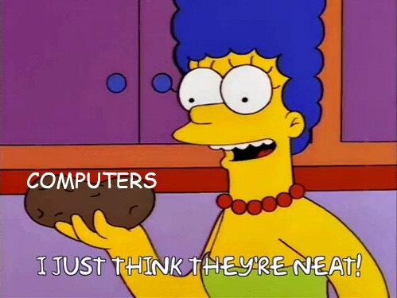

<div align="center">


</div>

```bash
root@marion:~$ whoami
marion_cuyas
root@marion:~$ cat profile.txt
Backend Developer | Security Enthusiast | Code Breaker & Builder
root@marion:~$ ls skills/
backend/  frontend/  security/  systems/
root@marion:~$ echo $PASSION
"Learning new things, playing with code, building cool&secure stuff"
root@marion:~$ ./start_session.sh
Session initiated. Welcome!
```


---

## 🛠️ Tech Arsenal

<details open>
<summary><b>💻 Programming & Frameworks</b></summary>
<br>


</details>

<details open>
<summary><b>🗄️ Backend Infrastructure</b></summary>
<br>


</details>

<details open>
<summary><b>🔒 Cybersecurity & Penetration Testing</b></summary>
<br>


</details>

<details open>
<summary><b>⚙️ Systems & DevOps</b></summary>
<br>


</details>

---

## 🎯 Current Focus

```java
public class Marion {
    private String currentFocus = "Mastering Backend Development and Becoming a SysAdmin";
    private String[] learning = {"Spring Security", "Hardware", "OS implementation"};
    private boolean openToCollaborate = true;
    
    public void dailyRoutine() {
        coffee()
        code();
        coffee()
        breakThings();
        coffee()
        learnFromMistakes();
        repeat();
    }
}
```

---

## 📊 GitHub Stats

<div align="center">


</div>


---

## 💭 Philosophy



I enjoy tinkering with computers and learning how they operate. In a world so digitalized it's crucial to have people that know how to fix, repair and secure them. Technology shapes our lives, and those who build it have a responsibility to protect it. That's why I'm here: to be part of that protection.

---

```bash
root@marion:~$ cat about_me.txt
Identity: Queer human navigating tech spaces
Approach: Unconventional solutions to conventional problems
Belief: Diverse perspectives make better security
Status: Drinking coffee

root@marion:~$ ./collaborate.sh
Open to connecting with amazing humans!
Let s build something awesome or do some CTF together :)

root@marion:~$ uptime
Always online, always learning, always playing

root@marion:~$ exit
Thanks for visiting! Feel free to reach out anytime.
Beep bop.
```

[](https://linkedin.com/in/mariona-cuyas)
[](https://tryhackme.com/p/Cuyas)
