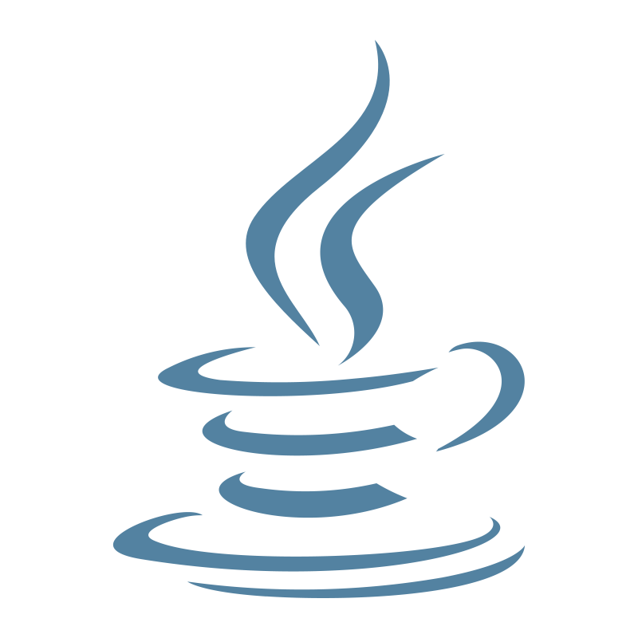

# Hi, I'm Marion! 

## WIP Full Stack Developer × Cybersecurity Analyst
I'm a fullstack developer with a passion for cybersecurity. I love building secure applications and breaking into systems (ethically, of course!).

---

### Tech Stack

  
  
  
  
  
  
  
  
  
  
  
  
  
  
  
  
  
  
  
  
  
  

<!--

-->

---

### Current Focus
- 📚 Studying for **CompTIA Security+** certification
- 🔓 Conquering every room on **TryHackMe**
- 🛠 Building projects that combine **web development** with **security principles**
- 🔍 Expanding my knowledge in **threat hunting and incident response**

---

---

### Connect With Me

---

---

> [!NOTE]
> 
> Apart from building or breaking things, I'm also...
> - A queer human navigating tech spaces
> - Blessed and/or cursed with ADHD and High-Learning Abilities
> - Finding unconventional solutions to conventional problems
> - Convinced that diverse perspectives make for better security

---

<!--
**cuyass/cuyass** is a ✨ _special_ ✨ repository because its `README.md` (this file) appears on your GitHub profile.

Here are some ideas to get you started:

- 🔭 I’m currently working on ...
- 🌱 I’m currently learning ...
- 👯 I’m looking to collaborate on ...
- 🤔 I’m looking for help with ...
- 💬 Ask me about ...
- 📫 How to reach me: ...
- 😄 Pronouns: ...
- ⚡ Fun fact: ...
-->
